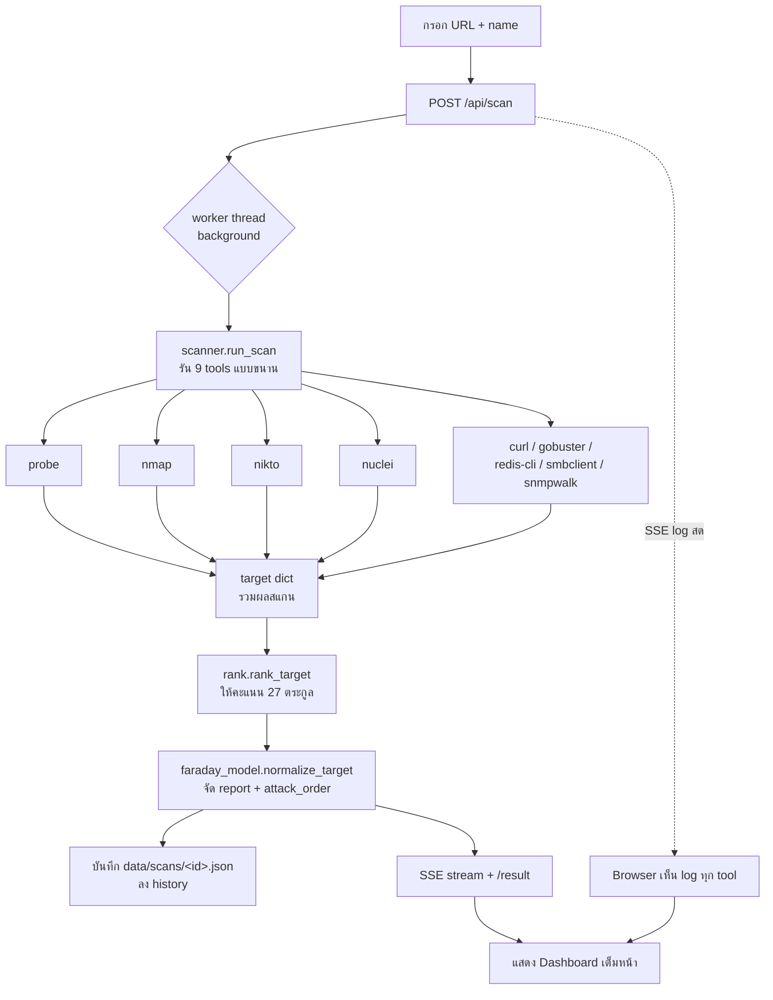
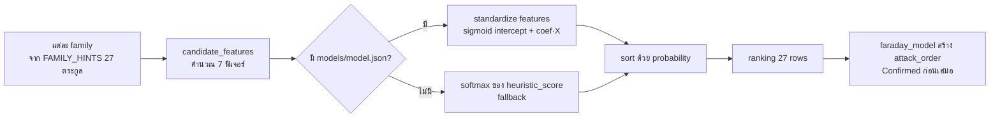
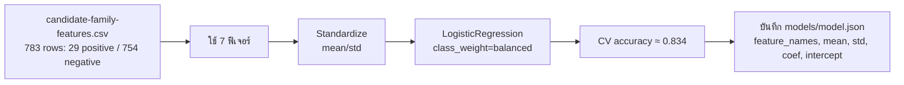

# Chimera — ระบบทำงานยังไง / Ranking / Features / การเทรน

> อธิบายสถาปัตยกรรมโปรโตไทป์ "Chimera Vulnerability Workbench"
> (Flask + scanner + rank + ML model) ฉบับภาษาไทย พร้อมไดอะแกรม

---

## 1. ภาพรวม Flow



### ลำดับขั้นตอนจริง

1. **กด Scan** → browser `POST /api/scan` `{url, name}` → ได้ `job_id`
2. เบื้องหลัง (worker thread) รัน 3 ขั้นตอน:
   - `scanner.run_scan(url)` — รัน 9 tools **ขนานกัน** สตรีม log สดผ่าน SSE ไปที่ UI
   - `rank.rank_target(target)` — ให้คะแนน 27 ตระกูล → ranking
   - `faraday_model.normalize_target(target)` — จัดเป็น report (host / services / vulnerabilities / attack_order)
3. บันทึกลง disk (`data/scans/<id>.json` + index) → ขึ้นเป็น history บนหน้าแรก
4. SSE ส่ง `event: done` → browser ดึง `/result` → แสดง Dashboard เต็มหน้า

---

## 2. Ranking ทำงานยังไง

เรียง 27 "ตระกูล" (framework/app) ว่าระบบนี้ **น่าจะเป็นอะไร** มากที่สุด



- **attack_order** = ลำดับ "ควรทดสอบอะไรก่อน" แบบผสมหลักฐาน:
  - เรียงตามสถานะ: `Confirmed < Reported < Open < Ranked`
  - แล้วตาม `severity` (critical สูงสุด)
  - แล้วตาม `confidence`

> หลักการสำคัญ: **หลักฐานจริง (nuclei/nikto เจอ CVE) ขึ้นก่อน** speculative ที่ได้จาก model

---

## 3. ฟีเจอร์ (Features) เป็นยังไง

ต่อ **1 ตระกูล** คำนวณจากข้อมูลสแกนจริง **7 ค่า**:

| # | ฟีเจอร์ | คำนวณยังไง |
|---|---------|-------------|
| 1 | `title_alias_score` | ชื่อตระกูลมีใน `<title>` ของหน้าไหม (เช่น "redis" ใน title) |
| 2 | `server_alias_score` | มีใน `Server:` / `X-Powered-By:` header |
| 3 | `nmap_alias_score` | มีใน banner / service line จาก nmap |
| 4 | `body_alias_score` | มีใน HTTP status / body |
| 5 | `port_score` | port ตรงกับ port ปกติของตระกูล (redis=6379) |
| 6 | `protocol_score` | เป็น HTTP หรือ non-HTTP ตรงกับธรรมชาติของตระกูล |
| 7 | `http_tool_score` | มีการสแกนด้วย probe/nikto/wapiti แล้ว (depth การตรวจ) |

**รวมเป็น heuristic score:**

```
heuristic_score = 2.5·title + 2.0·server + 2.0·nmap + 1.2·body
                + 0.7·port + 0.6·protocol + http_tool
```

> ⚠️ **Label leakage**: ห้ามใช้ชื่อ target, ชื่อตระกูล, หรือ CVE เป็นฟีเจอร์
> เพราะ model จะจำเลขแทนการเรียนรู้ช่องโหว่จริง (repo เตือนไว้ชัดเจน)

---

## 4. เทรนยังไง

`train_model.py` เทรน **Logistic Regression** (scikit-learn):



### ขั้นตอน

1. **ข้อมูล**: `candidate-family-features.csv` จาก repo (783 แถว, 29 positive : 754 negative)
2. **ฟีเจอร์**: 7 ค่าข้างบน → standardize (mean/std) ก่อนเข้า model
3. **Model**: `LogisticRegression(class_weight='balanced')` เพราะ label ไม่สมดุล (29:754)
4. **Validation**: cross-validation accuracy ≈ 0.834
5. **บันทึก**: `models/model.json` = `{feature_names, mean, std, coef, intercept}`

**น้ำหนักที่ model เรียนรู้จริง** (coef):

| ฟีเจอร์ | น้ำหนัก | ความหมาย |
|--------|--------|-----------|
| port | **+1.39** | สำคัญสุด |
| title | **+1.00** | |
| server | +0.37 | |
| nmap | +0.29 | |
| protocol | +0.33 | |
| http_tool | -0.11 | |
| body | 0.00 | |

### ที่ runtime

`rank.rank_target()` โหลด coef จาก `model.json` มาคูณกับฟีเจอร์ของ target ใหม่:

```
X = (features - mean) / std
logit = intercept + coef · X
probability = sigmoid(logit)
```

แล้ว sort family ด้วย probability → ใส่ลง attack_order

---

## 5. ตัวอย่างข้อมูลจริง (จาก report ที่บันทึกใน data/scans/)

ตัวอย่างจริงจากสแกน **DVWA** (`http://127.0.0.1:8081/`) เก็บใน `data/scans/2603175c17ed.json`

### 5.1 Target

```json
{
  "id": "127.0.0.1",
  "url": "http://127.0.0.1:8081/",
  "title": "Login :: Damn Vulnerable Web Application (DVWA) v1.10 *Development*",
  "server": "Apache/2.4.25 (Debian)",
  "http_status": "200"
}
```

### 5.2 Summary

```json
{
  "hosts": 1, "services": 1, "vulnerabilities": 22,
  "by_severity": {"critical": 1, "high": 0, "medium": 0, "low": 2, "info": 19},
  "open": 21, "confirmed": 20
}
```

### 5.3 Vulnerabilities (4 แรกจาก 22)

```json
[
  {"name": "dvwa-default-login",        "severity": "critical", "status": "Confirmed", "tool": "nuclei", "cve": ""},
  {"name": "mDNS-enum",                  "severity": "low",      "status": "Confirmed", "tool": "nuclei", "cve": ""},
  {"name": "missing-cookie-samesite-strict", "severity": "low",  "status": "Confirmed", "tool": "nuclei", "cve": ""},
  {"name": "cookies-without-secure",     "severity": "info",     "status": "Confirmed", "tool": "nuclei", "cve": ""}
]
```

### 5.4 Attack Order (3 แรก)

```json
[
  {"rank": 1, "family": "nuclei", "severity": "critical", "status": "Confirmed",
   "confidence": 1.0,  "source_tool": "nuclei", "method": "verify", "command": ""},
  {"rank": 2, "family": "nuclei", "severity": "low", "status": "Confirmed",
   "confidence": 0.35, "source_tool": "nuclei", "method": "verify", "command": ""},
  {"rank": 3, "family": "nuclei", "severity": "low", "status": "Confirmed",
   "confidence": 0.35, "source_tool": "nuclei", "method": "verify", "command": ""}
]
```

> ดูจากตัวอย่าง: DVWA โดน nuclei เจอ **default login (critical)** เป็นอันดับ 1
> — หลักฐานจริงขึ้นก่อน speculative เสมอ

---

## 6. ตัวอย่างผลจริง

สแกน **DVWA** (`http://127.0.0.1:8081/`, name=test-dvwa) ~91s (nuclei เต็มชุด 4289 templates):

```
summary:
  by_severity: {critical:1, high:0, medium:0, low:2, info:19}
  confirmed: 20, hosts: 1, open: 21, services: 1, vulnerabilities: 22

attack_order อันดับ 1:
  #1 critical | Confirmed | conf=1.00 | nuclei  ← หลักฐานจริงขึ้นก่อน
```

---

## 6. ข้อจำกัด + ทางไปต่อ

- Model ปัจจุบันเทรนจากข้อมูล **vulhub (weak label)** → บน target ที่ไม่ใช่ vulhub
  (เช่น Flask port 8080) ranking อาจไม่ติด top (flask ไม่มี port 8080 ในข้อมูลฝึก)
- อยากแม่นขึ้นต้องทำ **validation loop**:
  1. ยิง exploit จริงกับ candidate
  2. บันทึกผล success / fail (0/1)
  3. เพิ่ม label จริงเข้า dataset
  4. retrain model

→ ยิ่งสแกนมาก ยิ่งมี ground-truth จริง ยิ่งแม่น (active learning)
